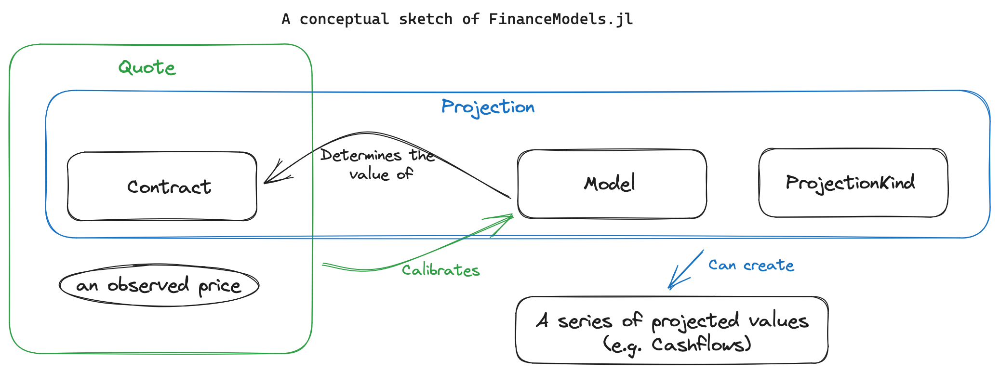

```@meta
CurrentModule = FinanceModels
```

# FinanceModels.jl

[](https://docs.juliaactuary.org/FinanceModels/stable/)
[](https://docs.juliaactuary.org/FinanceModels/dev/)
[](https://github.com/JuliaActuary/FinanceModels.jl/actions)
[](https://codecov.io/gh/JuliaActuary/FinanceModels.jl)

**FinanceModels.jl** provides a set of composable contracts, models, and functions that allow for modeling of both simple and complex financial instruments. The resulting models, such as discount rates or term structures, can then be used across the JuliaActuary ecosystem to perform actuarial and financial analysis.

Additionally, the models can be used to project contracts through time: most basically as a series of cashflows but more complex output can be defined for contracts.


## QuickStart

```julia
using FinanceModels

# a set of market-observed prices we wish to calibrate the model to
# annual effective unless otherwise specified
q_rate = ZCBYield([0.01,0.02,0.03]);
q_spread = ZCBYield([0.01,0.01,0.01]);

# bootstrap a linear spline yield model
model_rate = fit(Spline.Linear(),q_rate,Fit.Bootstrap());⠀           
model_spread = fit(Spline.Linear(),q_spread,Fit.Bootstrap());

# the zero rate is the combination of the two underlying rates
zero(m_spread + m_rate,1) # 0.02 annual effective rate 

# the discount is the same as if we added the underlying zero rates
discount(m_spread + m_rate,0,3) ≈ discount(0.01 + 0.03,3)   # true

# compute the present value of a contract (a cashflow of 10 at time 3)
present_value(m_rate,Cashflow(10,3)) # 9.15...
```

## Overview of FinanceModels



Often we start with observed or assumed values for existing contracts. We want to then use those assumed values to extend the valuation logic to new contracts. For example, we may have a set of bond yields which we then want to discount a series of insurance obligations.

In the language of FinanceModels, we would have a set of `Quote`s which are used to fit a `Model`. That model is then used to `discount` a new series of cashflows.

That's just an example, and we can use the various components in different ways depending on the objective of the analysis.

### Contracts and Quotes

Contracts are a way to represent financial obligations. These can be valued using a model, projected into a future steam of values, or combined with assumed prices as a `Quote`.

Included are a number of primitives and convenience methods for contracts:

Existing `struct`s:

- `Cashflow`
- `Bond.Fixed`
- `Bond.Floating`
- `Forward` (an obligation with a forward start time)
- `Composite` (combine two other contracts, e.g. into a swap)
- `EuroCall`
- `CommonEquity`
- `Option.Cap`, `Option.Floor`, `Option.Swaption` (interest rate derivatives)

Commonly, we deal with conventions that imply a contract and an observed price. For example, we may talk about a treasury yield of `0.03`. This is a description that implies a `Quote`ed price for an underling fixed bond. In FinanceModels, we could use `CMTYield(rate,tenor)` which would create a `Quote(price,Bond.Fixed(...))`. In this way, we can conveniently create a number of `Quote`s which can be used to fit models. Such convenience methods include:

- `ZCBYield`
- `ZCBPrice`
- `CMTYield`
- `ParYield`
- `ParSwapYield`
- `ForwardYield`

FinanceModels offers a way to define new contracts as well.

#### Cashflows

A `Cashflow`s obligation are themselves a contract, but other contracts can be considered as essentially anything that can be combined with assumptions (a **model**) to derive a collection of cashflows.

For example, a obligation that pays 1.75 at time 2 could be represented as: `Cashflow(1.75,2)`.

### Models

Models are objects that can be fit to observed prices and then subsequently used to make valuations of other cashflows/contracts.

Yield models include:

- `Yield.Constant`
- Bootstrapped `Spline`s
- `Yield.SmithWilson`
- `Yield.NelsonSiegel`
- `Yield.NelsonSiegelSvensson`

#### Yield-related functions

The models can be used to compute various rates of interest:

- `discount(curve,from,to)` or `discount(curve,to)` gives the discount factor
- `accumulation(curve,from,to)` or `accumulation(curve,to)` gives the accumulation factor
- `zero(curve,time)` or `zero(curve,time,Frequency)` gives the zero-coupon spot rate for the given time.
- `forward(curve,from,to)` gives the zero rate between the two given times
- `par(curve,time;frequency=2)` gives the coupon-paying par equivalent rate for the given time.

#### `ZeroRateCurve` — direct construction

Construct a zero-rate curve directly from rates and tenors, without fitting:

```julia
rates = [0.02, 0.025, 0.03, 0.035, 0.04]
tenors = [1.0, 2.0, 3.0, 5.0, 10.0]
zrc = ZeroRateCurve(rates, tenors)                          # default: MonotoneConvex
zrc = ZeroRateCurve(rates, tenors, Spline.Linear())          # or Linear, PCHIP, Cubic, Akima
```

`ZeroRateCurve` is compatible with ForwardDiff dual numbers, making it the primary interface for automatic differentiation-based sensitivities in [ActuaryUtilities.jl](https://github.com/JuliaActuary/ActuaryUtilities.jl).

#### Stochastic short-rate models

Simulate interest rate paths under classical short-rate dynamics:

- `ShortRate.Vasicek` — mean-reverting Gaussian: `dr = a(b - r)dt + σ dW`
- `ShortRate.CoxIngersollRoss` — square-root volatility: `dr = a(b - r)dt + σ√r dW`
- `ShortRate.HullWhite` — calibrated to an initial term structure: `dr = (θ(t) - ar)dt + σ dW`

```julia
using FinanceModels: ShortRate, simulate

zrc = ZeroRateCurve([0.03, 0.03, 0.03, 0.03, 0.03], [1.0, 2.0, 3.0, 4.0, 5.0])
hw = ShortRate.HullWhite(0.1, 0.01, zrc)

# Monte Carlo simulation — returns a vector of RatePath scenarios
scenarios = simulate(hw; n_scenarios=1000, timestep=1/12, horizon=30.0)

# Expected present value of a contract under stochastic rates
pv_mc(hw, Bond.Fixed(0.04, Periodic(1), 5); n_scenarios=1000)
```

Closed-form pricing for Gaussian models (Vasicek, Hull-White):
- Zero-coupon bond options via `present_value(model, Option.ZCBCall(...))`
- Interest rate caps and floors via `present_value(model, Option.Cap(...))`
- European swaptions via Jamshidian decomposition: `present_value(model, Option.Swaption(...))`

Other models include:

- `BlackScholesMerton` derivative valuation

##### Plotting of Yield Curves

In interactive sessions (e.g. REPL, Notebooks, VS Code, etc.) you can get a pretty printing of yield curves by also using `UnicodePlots.jl`, for example:

```julia-repl
julia> using FinanceModels
julia> q_rate = ZCBYield.([0.01, 0.02, 0.03,0.04,0.03],[1,3,5,10,20]);
julia> fit(Spline.PolynomialSpline(3), q_rate, Fit.Bootstrap())
FinanceModels.Yield.Spline{DataInterpolations.CubicSpline{Vector{Float64}, Vector{Float64}, Vector{Float64}, Vector{Float64}, true, Float64}}([0.009950330853168092, 0.009950330853168092, 0.019802627296179747, 0.02955880224154443, 0.0, 1.0, 2.0, 3.0])

julia> using UnicodePlots 
julia> fit(Spline.PolynomialSpline(3), q_rate, Fit.Bootstrap()) # after importing UnicodePlots
              ⠀⠀⠀⠀⠀⠀⠀⠀⠀⠀⠀Yield Curve (FinanceModels.Yield.Spline)⠀⠀⠀⠀⠀⠀⠀⠀⠀⠀⠀           
              ┌────────────────────────────────────────────────────────────┐           
         0.04 │⠀⠀⠀⠀⠀⠀⠀⠀⠀⠀⠀⠀⠀⠀⠀⠀⣀⠤⠖⠒⠊⠉⠉⠉⠒⠒⠢⠤⣄⡀⠀⠀⠀⠀⠀⠀⠀⠀⠀⠀⠀⠀⠀⠀⠀⠀⠀⠀⠀⠀⠀⠀⠀⠀⠀⠀⠀⠀⠀⠀│ Zero rates
              │⠀⠀⠀⠀⠀⠀⠀⠀⠀⠀⠀⠀⠀⣀⠔⠋⠀⠀⠀⠀⠀⠀⠀⠀⠀⠀⠀⠀⠀⠈⠑⠒⢄⡀⠀⠀⠀⠀⠀⠀⠀⠀⠀⠀⠀⠀⠀⠀⠀⠀⠀⠀⠀⠀⠀⠀⠀⠀⠀⠀│           
              │⠀⠀⠀⠀⠀⠀⠀⠀⠀⠀⠀⢀⠖⠁⠀⠀⠀⠀⠀⠀⠀⠀⠀⠀⠀⠀⠀⠀⠀⠀⠀⠀⠀⠈⠑⠢⣄⡀⠀⠀⠀⠀⠀⠀⠀⠀⠀⠀⠀⠀⠀⠀⠀⠀⠀⠀⠀⠀⠀⠀│           
              │⠀⠀⠀⠀⠀⠀⠀⠀⠀⠀⡔⠁⠀⠀⠀⠀⠀⠀⠀⠀⠀⠀⠀⠀⠀⠀⠀⠀⠀⠀⠀⠀⠀⠀⠀⠀⠀⠉⠒⢄⡀⠀⠀⠀⠀⠀⠀⠀⠀⠀⠀⠀⠀⠀⠀⠀⠀⠀⠀⠀│           
              │⠀⠀⠀⠀⠀⠀⠀⠀⢠⠎⠀⠀⠀⠀⠀⠀⠀⠀⠀⠀⠀⠀⠀⠀⠀⠀⠀⠀⠀⠀⠀⠀⠀⠀⠀⠀⠀⠀⠀⠀⠉⠓⠤⡀⠀⠀⠀⠀⠀⠀⠀⠀⠀⠀⠀⠀⠀⠀⠀⠀│           
              │⠀⠀⠀⠀⠀⠀⠀⢠⠎⠀⠀⠀⠀⠀⠀⠀⠀⠀⠀⠀⠀⠀⠀⠀⠀⠀⠀⠀⠀⠀⠀⠀⠀⠀⠀⠀⠀⠀⠀⠀⠀⠀⠀⠈⠑⠦⣄⡀⠀⠀⠀⠀⠀⠀⠀⠀⠀⠀⠀⠀│           
              │⠀⠀⠀⠀⠀⠀⢠⠇⠀⠀⠀⠀⠀⠀⠀⠀⠀⠀⠀⠀⠀⠀⠀⠀⠀⠀⠀⠀⠀⠀⠀⠀⠀⠀⠀⠀⠀⠀⠀⠀⠀⠀⠀⠀⠀⠀⠀⠉⠓⠦⣄⡀⠀⠀⠀⠀⠀⠀⠀⠀│           
   Continuous │⠀⠀⠀⠀⠀⢠⠇⠀⠀⠀⠀⠀⠀⠀⠀⠀⠀⠀⠀⠀⠀⠀⠀⠀⠀⠀⠀⠀⠀⠀⠀⠀⠀⠀⠀⠀⠀⠀⠀⠀⠀⠀⠀⠀⠀⠀⠀⠀⠀⠀⠀⠈⠉⠒⠒⠦⠤⠤⠤⠤│           
              │⠀⠀⠀⠀⢀⠎⠀⠀⠀⠀⠀⠀⠀⠀⠀⠀⠀⠀⠀⠀⠀⠀⠀⠀⠀⠀⠀⠀⠀⠀⠀⠀⠀⠀⠀⠀⠀⠀⠀⠀⠀⠀⠀⠀⠀⠀⠀⠀⠀⠀⠀⠀⠀⠀⠀⠀⠀⠀⠀⠀│           
              │⠀⠀⠀⢀⡎⠀⠀⠀⠀⠀⠀⠀⠀⠀⠀⠀⠀⠀⠀⠀⠀⠀⠀⠀⠀⠀⠀⠀⠀⠀⠀⠀⠀⠀⠀⠀⠀⠀⠀⠀⠀⠀⠀⠀⠀⠀⠀⠀⠀⠀⠀⠀⠀⠀⠀⠀⠀⠀⠀⠀│           
              │⠀⠀⢀⠎⠀⠀⠀⠀⠀⠀⠀⠀⠀⠀⠀⠀⠀⠀⠀⠀⠀⠀⠀⠀⠀⠀⠀⠀⠀⠀⠀⠀⠀⠀⠀⠀⠀⠀⠀⠀⠀⠀⠀⠀⠀⠀⠀⠀⠀⠀⠀⠀⠀⠀⠀⠀⠀⠀⠀⠀│           
              │⠒⠒⠃⠀⠀⠀⠀⠀⠀⠀⠀⠀⠀⠀⠀⠀⠀⠀⠀⠀⠀⠀⠀⠀⠀⠀⠀⠀⠀⠀⠀⠀⠀⠀⠀⠀⠀⠀⠀⠀⠀⠀⠀⠀⠀⠀⠀⠀⠀⠀⠀⠀⠀⠀⠀⠀⠀⠀⠀⠀│           
              │⠀⠀⠀⠀⠀⠀⠀⠀⠀⠀⠀⠀⠀⠀⠀⠀⠀⠀⠀⠀⠀⠀⠀⠀⠀⠀⠀⠀⠀⠀⠀⠀⠀⠀⠀⠀⠀⠀⠀⠀⠀⠀⠀⠀⠀⠀⠀⠀⠀⠀⠀⠀⠀⠀⠀⠀⠀⠀⠀⠀│           
              │⠀⠀⠀⠀⠀⠀⠀⠀⠀⠀⠀⠀⠀⠀⠀⠀⠀⠀⠀⠀⠀⠀⠀⠀⠀⠀⠀⠀⠀⠀⠀⠀⠀⠀⠀⠀⠀⠀⠀⠀⠀⠀⠀⠀⠀⠀⠀⠀⠀⠀⠀⠀⠀⠀⠀⠀⠀⠀⠀⠀│           
            0 │⠀⠀⠀⠀⠀⠀⠀⠀⠀⠀⠀⠀⠀⠀⠀⠀⠀⠀⠀⠀⠀⠀⠀⠀⠀⠀⠀⠀⠀⠀⠀⠀⠀⠀⠀⠀⠀⠀⠀⠀⠀⠀⠀⠀⠀⠀⠀⠀⠀⠀⠀⠀⠀⠀⠀⠀⠀⠀⠀⠀│           
              └────────────────────────────────────────────────────────────┘           
              ⠀0⠀⠀⠀⠀⠀⠀⠀⠀⠀⠀⠀⠀⠀⠀⠀⠀⠀⠀⠀⠀⠀⠀⠀⠀⠀⠀time⠀⠀⠀⠀⠀⠀⠀⠀⠀⠀⠀⠀⠀⠀⠀⠀⠀⠀⠀⠀⠀⠀⠀⠀⠀⠀⠀30⠀           

```

> [!NOTE]
> This was built-in prior to v4.9 of FinanceModels. It has been split out to materially speed up `using FinanceModels`.

### Projections

Most basically, we can project a contract into a series of `Cashflow`s:

```julia-repl
julia> b = Bond.Fixed(0.04,Periodic(2),3)
FinanceModels.Bond.Fixed{Periodic, Float64, Int64}(0.04, Periodic(2), 3)

julia> collect(b)
6-element Vector{Cashflow{Float64, Float64}}:
 Cashflow{Float64, Float64}(0.02, 0.5)
 Cashflow{Float64, Float64}(0.02, 1.0)
 Cashflow{Float64, Float64}(0.02, 1.5)
 Cashflow{Float64, Float64}(0.02, 2.0)
 Cashflow{Float64, Float64}(0.02, 2.5)
 Cashflow{Float64, Float64}(1.02, 3.0)
```

However, `Projection`s allow one to combine three elements which can be extended to define any desired output (such as amortization schedules, financial statement projections, or account value rollforwards). The three elements are:

- the underlying **contract** of interest
- the **model** which includes assumptions of how the contract will behave
- a `ProjectionKind` which indicates the kind of output desired (cashflow stream, amortization schedule, etc...)

#### Examples

A fixed bond that needs no valuation model (`NullModel()`) to define its projected gross cashflows:

```julia
Projection(Bond.Fixed(0.04,Periodic(2),3),NullModel(),CashflowProjection())
```

#### Plotting Projections

A `CashflowProjection` or a vector of `Cashflow`s can be plotted with the [Makie](https://makie.org/) family of plotting packages.

```julia
using FinanceModels, CairoMakie
proj = Projection(Bond.Fixed(0.10,Periodic(2),20),NullModel(),CashflowProjection())
# a stem plot:
stem(proj)
```

Will produce:


### Fitting Models

### Fitting Models

```plaintext
       Model                                                               Method
          |                                                                   |
   |------------|                                                     |---------------|
fit(Spline.Cubic(), CMTYield.([0.04,0.05,0.055,0.06,0055],[1,2,3,4,5]), Fit.Bootstrap())
                    |-------------------------------------------------|
                                              |
                                              Quotes
```

- **Model** could be `Spline.Linear()`, `Yield.NelsonSiegelSvensson()`, `Equity.BlackScholesMerton(...)`, etc.
- **Quote** could be `CMTYield`s, `ParYield`s, `Option.Eurocall`, etc.
- **Method** could be `Fit.Loss(x->x^2)`, `Fit.Loss(x->abs(x))`, `Fit.Bootstrap()`, etc.

This unified way to fit models offers a much simpler way to extend functionality to new models or contract types.

#### Using Models

After being fit, models can be used to value contracts:

```julia
present_value(model,cashflows)
```

Additionally, [ActuaryUtilities.jl](https://github.com/JuliaActuary/ActuaryUtilities.jl) offers a number of other methods that can be used, such as `duration`, `convexity`, `price` which can be used for analysis with the fitted models.

### Rates

Rates are types that wrap scalar values to provide information about how to determine `discount` and `accumulation` factors.

There are two `Frequency` types:

- `Periodic(m)` for rates that compound `m` times per period (e.g. `m` times per year if working with annual rates).
- `Continuous()` for continuously compounding rates.

#### Examples

```julia
Continuous(0.05)       # 5% continuously compounded
Periodic(0.05,2)       # 5% compounded twice per period
```

These are both subtypes of the parent `Rate` type and are instantiated as:

```julia
Rate(0.05,Continuous())       # 5% continuously compounded
Rate(0.05,Periodic(2))        # 5% compounded twice per period
```

Rates can also be constructed by specifying the `Frequency` and then passing a scalar rate:

```julia
Periodic(1)(0.05)
Continuous()(0.05)
```

#### Conversion

Convert rates between different types with `convert`. E.g.:

```julia-repl
r = Rate(FinanceModels.Periodic(12),0.01)             # rate that compounds 12 times per rate period (ie monthly)

convert(FinanceModels.Periodic(1),r)                  # convert monthly rate to annual effective
convert(FinanceModels.Continuous(),r)          # convert monthly rate to continuous
```

#### Arithmetic

Adding, substracting, multiplying, dividing, and comparing rates is supported.

## Guide and Documentation

A guide which explains more about the components of the package and from-scratch examples of extending the package is available in the [documenation](https://docs.juliaactuary.org/FinanceModels/dev/)

## Exported vs Un-exported Functions

Generally, CamelCase methods which construct a datatype are exported as they are unlikely to conflict with other parts of code that may be written. For example, `rate` is un-exported (it must be called with `FinanceModels.rate(...)`) because `rate` is likely a very commonly defined variable within actuarial and financial contexts and there is a high risk of conflicting with defined variables.

Consider using `import FinanceModels` which would require qualifying all methods, but alleviates any namespace conflicts and has the benefit of being explicit about the calls (internally we prefer this in the package design to keep dependencies and their usage clear).

## Internals

For time-variant FinanceModels (ie yield *curves*), the inputs are converted to spot rates and interpolated using quadratic B-splines by default (see documentation for alternatives, such as linear interpolations).

### Combination Implementation

[Combinations](#combinations) track two different curve objects and are not combined into a single underlying data structure. This means that you may achieve better performance if you combine the rates before constructing a `FinanceModels` representation. The exception to this is `Constant` curves, which *do* get combined into a single structure that is as performant as pre-combined rate structure.

## Related Packages

- [**`InterestRates.jl`**](https://github.com/felipenoris/InterestRates.jl) specializes in fast rate calculations aimed at valuing fixed income contracts, with business-day-level accuracy.
  - Comparative comments: **`FinanceModels.jl`** does not try to provide as precise controls over the timing, structure, and interpolation of the curve. Instead, **`FinanceModels.jl`** provides a minimal, but flexible and intuitive interface for common modeling needs.
